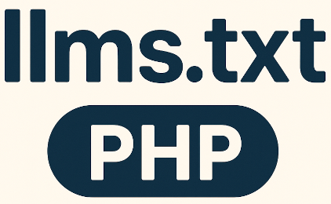

# llms.txt PHP


[](https://packagist.org/packages/stolt/llms-txt-php)


[](https://github.com/php-pds/skeleton)


<p align="center">
    
</p>

This library supports you in creating, reading, and validating [llms.txt](https://llmstxt.org/) Markdown files via PHP.
A good example `llms.txt` file is the [one](https://docs.astral.sh/uv/llms.txt) from the [uv](https://docs.astral.sh/uv/) project.

## What's llms.txt?

Think of it like `robots.txt` for LLMs. The evolving spec is available over [here](https://llmstxt.org/). 
For the structure of a `llms.txt` file you can also have a look at this repository's [llms.txt](llms.txt) file.

## Installation and usage

```bash
composer require stolt/llms-txt-php
```

### Creating a llms.txt file

```php
use Stolt\LlmsTxt\LlmsTxt;
use Stolt\LlmsTxt\Section;
use Stolt\LlmsTxt\Section\Link;

$section1 = (new Section())->name('Section name')
    ->addLink((new Link())->urlTitle('Link title')
        ->url('https://link_url')->urlDetails('Optional link details')
    );
$section2 = (new Section())->name('Optional')
    ->link((new Link())->urlTitle('Link title')
        ->url('https://link_url')
    );

$llmsTxt = (new LlmsTxt())->title('Test title')
  ->description('Test description')
  ->details('Test details')
  ->addSection($section1) // OR ->addSections([$section1, $section2])
  ->section($section2) // alias method
  ->toString(); // OR ->toFile('/path/to/llmsTxtToBe.md');
```

### Validating and reading a llms.txt file and its parts

```php
use Stolt\LlmsTxt\LlmsTxt;

$llmsText = (new LlmsTxt())->parse('/path/to/llmsTxt.md'); // OR parse('markdown-string')

if ($llmsText->validate()) {
    $title = $llmsText->getTitle();
    $description = $llmsText->getDescription();
    $details = $llmsText->getDetails();
    $sections = $llmsText->getSections();
}
```

For more usage examples, have a look at the tests i.e. [LlmsTxtTest.php](tests/LlmsTxtTest.php).

> [!TIP]
> To interact with `llms.txt` files from the console, the complement package [llms-txt-php-cli](https://github.com/raphaelstolt/llms-txt-php-cli) might come in handy.

### Running tests

``` bash
composer test
```

### License

This library is licensed under the MIT license. Please see [LICENSE.md](LICENSE.md) for more details.

### Changelog

Please see [CHANGELOG.md](CHANGELOG.md) for more details.

### Contributing

Please see [CONTRIBUTING.md](.github/CONTRIBUTING.md) for more details.
